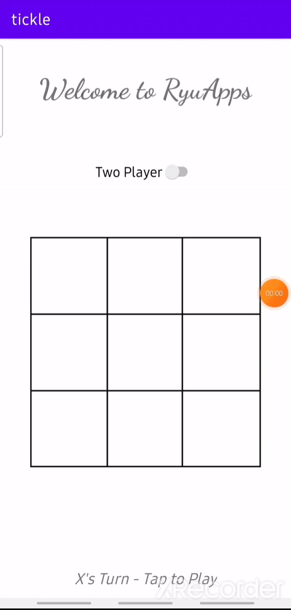

# Tickle
## The original Tic Tac Toe game

### Gameplay

    

### Features

 - Two player mode
 - Single player mode

### Technologies used

- Java
- XML
- Android SDK

### Pre-requisites

- Android Studio 4.x

### How to install
- Download the [tickle.apk](https://github.com/RRkundkar777/tickle/raw/master/tickle.apk) and enjoy.

### Developed by
[Rushikesh Kundkar](https://github.com/RRkundkar777)  

### Status
